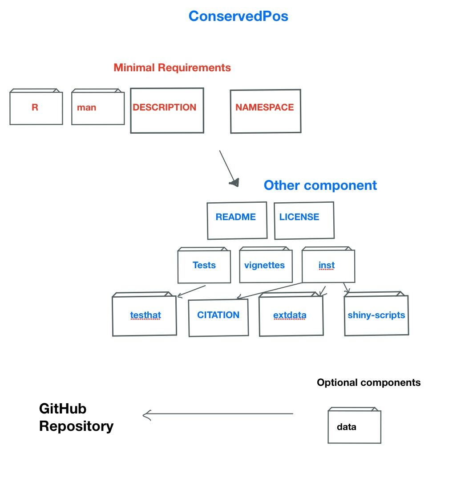

<!-- README.md is generated from README.Rmd. Please edit that file -->

```{r, include = FALSE}
knitr::opts_chunk$set(
  collapse = TRUE,
  comment = "#>",
  fig.path = "man/figures/README-",
  out.width = "100%"
)
```

# conservedPos

<!-- badges: start -->
<!-- badges: end -->

## Description
Description: The goal of conservedPos package is to find important conserved sites for small target region by conducting a site-specific analysis for a set of aligned DNA sequences. 
The package will provide function to count nucleotides occurrances in each position independently and calculates the frequency of the nucleotides in order to quantify the conservity of each position.

## Installation

You can install the released version of conservedPos 

``` r
require("devtools")
devtools::install_github("hezijin/conservedPos", build_vignettes = TRUE)
library("conservedPos")

```

To run the Shiny app:

``` r
runconservedPos()
```

For tutorial how to use:
```r
browseVignettes("conservedPos")
```
## Overview

``` r
ls("package:conservedPos")
data(package = "conservedPos")
```

The package contains 5 function to reformat and analyze the input
sequences and 2 function to plot for the result. createPosVec() grabs
the nucleotide for all of sequences at index position. Then in
conservityTable(), it loops all of the index and calculate the most
conserved nucleotide frequency through findConservityFromS(). We can also use findConservedNul() to find the conserved nucleotide at specific site and findMaxLen() to find the max length for sequence set. 

plotOverall() plots the overall alignment’s conservity using the
conservity vector generated from the function conservityTable while
plotPartial()plots the seleted region from users.

Overview picture for the package:




## Contribution
The idea of developing this package is inspired by PWM Viewing and
Searching. The way of clear up and reformat sequence string in function
createPosVec is referenced to many website (show in Reference section).
The idea of function findConservityFromS comes from the function in
Biostirngs package function NucleotideFrequencyAt, while my function
avoids the limitation of the input (NucleotideFrequencyAt is not allowed
to use stirngs with NA, which means length of the input sequences need
to be equal).The function findConservedNul() uses the idea from stack overflow.(see reference 8)

The function findMaxLen and conservityTable are written by
me. The way of generate bar plot comes from R language Tutorial(show in
Reference section) and used in function plotOverall and plotPartial.

## Reference
1. Silva, A. (2020) TestingPackage: An Example R Package For BCB410H. Unpublished. URL https://github.com/anjalisilva/TestingPackage

2. R Bar Plot (2018) DataMentor. Getting Started in Data Science With R. https://www.datamentor.io/r-programming/bar-plot/

3. Lab 1: Biostrings in R. (2019) Susan Holmes and Wolfgang. Huberhttps://web.stanford.edu/class/bios221/labs/biostrings/lab_1_biostrings.html

4. R - Bar Charts. Bar Chart Labels, Title and Colors.(2020) Tutorialpoints-R Tutorial. https://www.tutorialspoint.com/r/r_bar_charts.htm

5. H. Pagès, P. Aboyoun, R. Gentleman and S. DebRoy (2020). Biostrings: Efficient manipulation of biological strings. R package version 2.58.0. https://bioconductor.org/packages/Biostrings
  
6. Orchestrating high-throughput genomic analysis with Bioconductor. W. Huber, V.J. Carey, R. Gentleman, ..., M. Morgan Nature Methods, 2015:12, 115.
  
7. Bembom O, Ivanek R (2020). seqLogo: Sequence logos for DNA sequence alignments. R package version 1.56.0. http://www.bioconductor.org/packages/release/bioc/html/seqLogo.html

8. Antonis. (2018) How to find the most repeated word in a vector with R. 
Stack oveflow. https://stackoverflow.com/questions/48632957/how-to-find-the-most-repeated-word-in-a-vector-with-r


## Acknowledgements

This package was developed as part of an assessment for 2020BCB410H: Applied Bioinformatics, University of Toronto, Toronto,CANADA.
