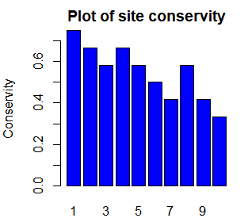

## Introduction
The package will provide function to count nucleotides occurrances in each position independently and calculates the frequency of the nucleotides in order to quantify the conservity of each position. You can use 2 plot function (plotOverall, plotPartial) to visualize the analysis from your input.

## Downlaod and Overview
You can install the released version of conservedPos 

``` r
require("devtools")
devtools::install_github("hezijin/conservedPos", build_vignettes = TRUE)
library("conservedPos")

```

To run the Shiny app:

``` r
runconservedPos()
```


## Inputing data
I recommend you to prepare a short aligned sequence fasta/txt file as the input. Usually you can blast a target sequence from NCBI blasttn and download the aligned sequences file from result page. However long sequence may take a long time to run the function. 
Although the function is not sensitive to the unequal length of the input sequence, a relatively equal and aligned set of sequences will increase the accuracy of calculating conserved nucleotide frequency in each site. 

# Examples
Use the data from data file and raw data from extdata to show exampels.

Example 1: using raw data, create conservity table and plot partially:

```r
findpath <- system.file("extdata", "sampleSeq3.txt", package = "conservedPos")
rawSeq <- Biostrings::readBStringSet(findpath,"fasta")
table  <- conservityTable(rawSeq)
oPar <- par(mar = c(2, 4, 2, 1))
plotPartial(table, 1, 10)
```
Example 2: using data file, create conservity table and plot overally:

```r
data(testSeqShort)
testSeq <- testSeqShort
table  <- conservityTable(testSeq)
oPar <- par(mar = c(2, 4, 2, 1)) 
plotOverall(table)
```

Example 3: for using data file, analyze specific site conservity and find max length of sequence set:

```r
data(testSeqShort)
testSeq <- testSeqShort
positionVec <- createPosVec(testSeq,  11) # choose to analyze position 11
ConservedNul <- findConservedNul(positionVec)
conservity <- findConservityFromS(positionVec)

```

Result for example 3:
```r
> positionVec
[1] "CAA"
> ConservedNul
[1] "A"
> conservity
[1] 0.6666667
```

## Visualize the result

Example 1:



Example 2:


## Package References
  Zijin, H.(2020) conservedPos: Conserved Position Analysis
  Tool. Unpublished. URL
  https://github.com/hezijin/conservedPos

```{r}
sessionInfo()
```
